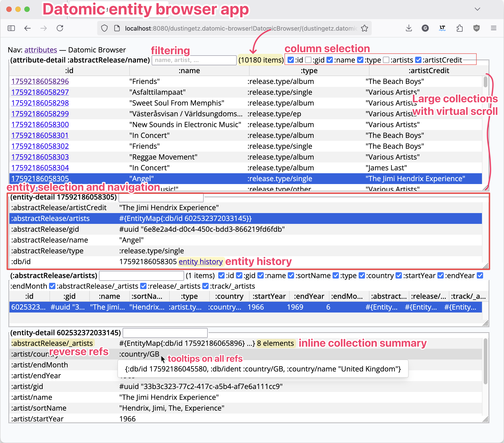
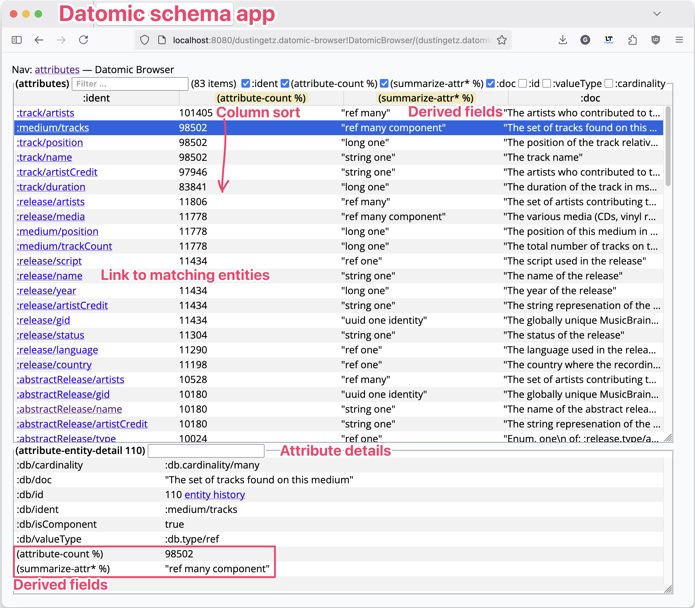

# Datomic entity browser

This app is an easy way to get a generic web-based support/diagnostics UI for any production Datomic service, with the ability to extend using Clojure to add custom queries, routes, and views.

This app is **150 LOC** + datomic helpers! See: [datomic-browser2.cljc](https://github.com/hyperfiddle/datomic-browser/blob/main/src/dustingetz/datomic_browser2.cljc)

We built this as a demonstration of something that is difficult to build in Clojure/Script, but is a straightforward 500 LOC in Electric Clojure, and is now essentially trivialized by "Hyperfiddle". [Hyperfiddle](https://github.com/hyperfiddle/hyperfiddle) is an Electric library for building high fidelity enterprise frontends for any service, function or object.

[](./docs/20250627_datomic_entity_browser.png)

Datomic browser features:

* **large Datomic databases** and large query results (50k+ result count)
* **monitor and kill slow queries from very large databases** -- coming very soon, currently in test
* entity navigation, automatic reverse attribute display and navigation
* entity preview tooltip on all IDs and refs
* query perf diagnostics (io-stats, query-stats etc)
* classpath connected for custom queries (direct classpath linking to any function)
* ORM-compatible, query Datomic however you want with Clojure functions
* fluid virtual scroll over 50k record collections
* automatic filtering and sort for queries returning < 10k records
* supports large queries > 10k records performantly (bring your own sublinear sort/filter logic)
* streaming lazy queries e.g. qseq – we have a prototype, contact us
* pull human readable idents on low level IDs such as datom tuples
* tables have column selection and inference
* derived fields and "virtual attributes" (functions over entities)
* built-in schema browser with attribute counts, docstrings, search, avet index
* built-in entity history view
* easy to integrate ring middleware - embed in your at-work httpkit or jetty services
* enterprise SSO (contact us)

[](./docs/20250627_datomic_schema_app.png)

**FAQ: Which Datomic product lines are supported?**
* Datomic Onprem, Peer API: supported
* Datomic Onprem, Client API: possible, contact us
* Datomic Cloud, Client API: possible, contact us
* Datomic Cloud, Ions: unsupported, Electric uses a websocket, afaik nobody has attempted running Electric in an Ion yet.

## Getting started

Prerequisites
* `java -version` modern version, we use `openjdk version "23.0.2"`
* Clojure CLI https://clojure.org/guides/install_clojure

```shell
git clone git@gitlab.com:hyperfiddle/datomic-browser.git
cd datomic-browser
./datomic_fixtures.sh                   # Download Datomic w/ mbrainz dataset
./run_datomic.sh
clj -X:dev dev/-main :datomic-uri '"datomic:dev://localhost:4334/mbrainz-1968-1973"'
# Please sign up or login to activate: ...
# INFO  dev: 👉 http://0.0.0.0:8080
```

Repl: jack-in with `:dev` alias, then eval `(dev/-main {:datomic-uri "datomic:dev://localhost:4334/mbrainz-1968-1973"})`

## License
* free for individual use on local dev machines, mandatory runtime login (we are a business)
* using in prod requires a license, contact us.
* still working out the details
