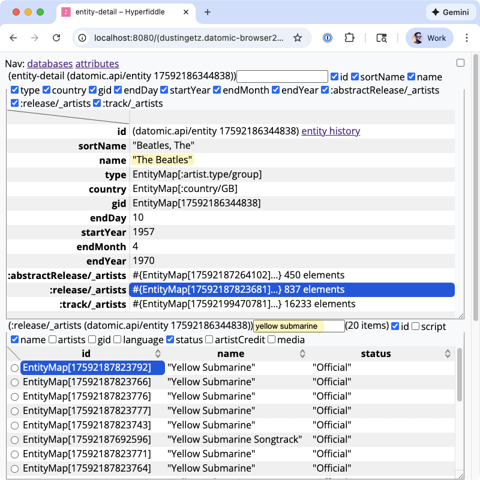
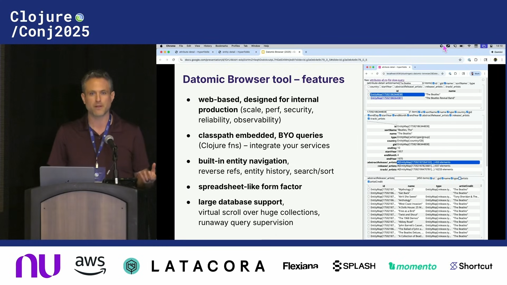

# A Datomic entity browser for prod

This app is an easy way to get a generic web-based support/diagnostics UI for any production Datomic service, with the ability to extend using Clojure to add custom queries, routes, and views.

[](./docs/20260126-datomic-entity-browser-square-2.png)
*Figure: Datomic browser targetting an entity in the mbrainz-full dataset, a music catalogue. Here we inspect the entity for :artist/name "The Beatles" and filter for that artist's releases titled "Yellow Submarine".*

## 10min lightning talk – Conj 2025 (start here!)

<div align="center">
  <a href="https://www.youtube.com/watch?v=dmucZkE5gd0" target="_blank">
    
  </a>
</div>

<br>

* [youtube](https://www.youtube.com/watch?v=dmucZkE5gd0), [transcript with screenshots](https://github.com/daveliepmann/talk-transcripts/blob/master/Getz_Dustin/ADatomicEntityBrowserForProd.md)
* **Get a demo:** DM @dustingetz on Clojurians slack, or email dustin@hyperfiddle.net.
* For updates, follow on twitter here: https://x.com/dustingetz

## Features

Standalone **Datomic Browser** mode (connect by Datomic URI)
* Out of the box, a general Datomic entity browser
* schema views, db-stats, history views, searchable EAVT index, entity navigation, reverse refs, etc
* large database support, fluent virtual scroll over 50k+ records
* "It has everything you would want"

Integrated **Service Browser** mode (service intermediated query)
* securely embed in your service as a Clojure lib -- no direct Datomic URI connection
* invoke and navigate your actual service query endpoints (Clojure fns)
* integrate your secure production ring middlewares for auth, etc
* custom entrypoint and dependency injection – integrate your standard service dependencies to invoke the service endpoints you already have
* first class support for **PII protection**
* built-in query supervision feature to safeguard against slow queries

By the way, it's only like 300 LOC: [datomic_browser2.cljc](https://github.com/hyperfiddle/datomic-browser/blob/main/src/dustingetz/datomic_browser2.cljc). Fork it! Program it!

## Getting started

Prerequisites
* `java -version` modern version, we use `openjdk version "23.0.2"`
* Clojure CLI https://clojure.org/guides/install_clojure

```shell
git clone git@github.com:hyperfiddle/datomic-browser.git
cd datomic-browser
./datomic_fixtures_mbrainz_small.sh       # Download Datomic w/ mbrainz dataset
#./datomic_fixtures_mbrainz_full.sh       # optional
./run_datomic.sh
clj -X:dev dev/-main
# Please login with any email to activate automatically: ...
# INFO  dev: 👉 http://0.0.0.0:8080

# boot with Datomic transactor URI
clj -X:dev dev/-main :datomic-uri '"'datomic:dev://localhost:4334/*'"'
```

Repl: jack-in with `:dev` alias, then eval `(dev/-main)`

## License
* free for individual use on local dev machines, free use requires login to activate (we are a business)
* deploying in prod at work requires a license, contact us.
* still working out the details

<!-- ## 30s teaser video

https://gist.github.com/user-attachments/assets/57357fae-31f8-4f46-b498-1c4851d60119 -->

<!-- [](./docs/20250627_datomic_entity_browser.png)

[](./docs/20250627_datomic_schema_app.png) -->

<!-- ## Features

* **large Datomic databases** and large query results (50k+ result count)
* **monitor and kill slow queries from very large databases** -- coming very soon, currently in test
* entity navigation, automatic reverse attribute display and navigation
* entity preview tooltip on all IDs and refs
* query perf diagnostics (io-stats, query-stats etc)
* classpath connected for custom queries (direct classpath linking to any function)
* ORM-compatible, query Datomic however you want with Clojure functions
* fluid virtual scroll over 50k record collections
* automatic filtering and sort for queries returning < 10k records
* supports large queries > 10k records performantly (bring your own sublinear sort/filter logic)
* streaming lazy queries e.g. qseq – we have a prototype, contact us
* pull human readable idents on low level IDs such as datom tuples
* tables have column selection and inference
* derived fields and "virtual attributes" (functions over entities)
* built-in schema browser with attribute counts, docstrings, search, avet index
* built-in entity history view
* easy to integrate ring middleware - embed in your at-work httpkit or jetty services
* enterprise SSO (contact us)

[](./docs/20250627_datomic_schema_app.png)

**FAQ: Which Datomic product lines are supported?**
* Datomic Onprem, Peer API: supported
* Datomic Onprem, Client API: possible, contact us
* Datomic Cloud, Client API: possible, contact us
* Datomic Cloud, Ions: unsupported, Electric uses a websocket, afaik nobody has attempted running Electric in an Ion yet. -->