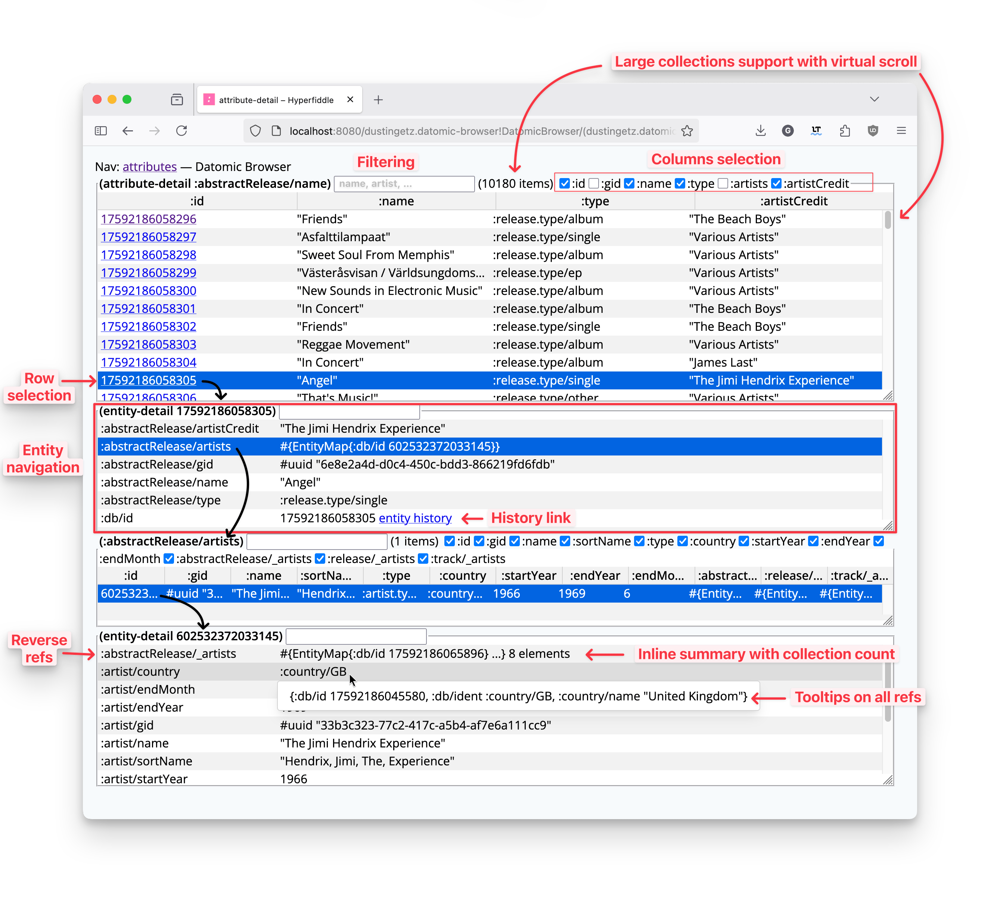
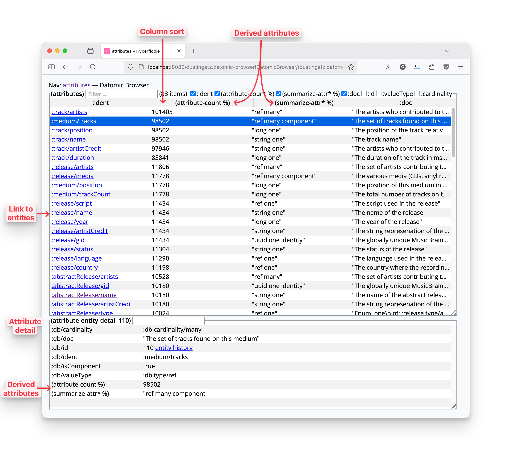
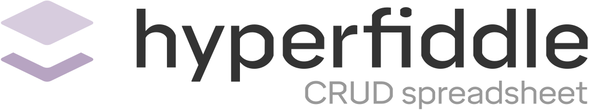

# Hyperfiddle starter app

Build custom application GUIs for your pre-existing enterprise backends in minutes, not months.

Hyperfiddle is a programmable object navigator supporting your at-work enterprise objects in prod. For growth stage production support teams supporting JVM backends at logistics/ops heavy businesses.


## Getting started

```
git clone git@gitlab.com:hyperfiddle/hyperfiddle-starter-app.git
cd hyperfiddle-starter-app

# Install demo data
./datomic_fixtures.sh # get Datomic (free) and example data
./run_datomic.sh

# Run demo app. You’ll be asked to authenticate.
clj -X:dev dev/-main :datomic-uri '"datomic:dev://localhost:4334/mbrainz-1968-1973"'

# or at the REPL:
# user=> (dev/-main {:datomic-uri "datomic:dev://localhost:4334/mbrainz-1968-1973"})
```
## Features

* prod-ready, web-based
* enterprise objects reachable through direct classpath linking
* streamlined navigator UX with table-pickers and powerful grids
* scalable UI infrastructure (powered by [Electric Clojure](https://github.com/hyperfiddle/electric))
* programmable framework, not just a static developer tool
* programmable queries, user controls all queries (direct classpath linking)
* programmable grids, forms, hyperlinks and routing through declarative hypermedia DSL
* full progressive enhancement with web technologies (HTML, CSS, frontend, backend)
* same security model as production web apps
* **NO REST APIs.** Never write an internal tool REST API ever again!

## Direct classpath linking to integrate any data source or native object

* **Not just Datomic:** navigate SQL or any backend data source via classpath function calls
* **Not just databases:** navigate clojure namespaces, file system, internal service state – literally any object
* **Not just Clojure:** call Java functions via classpath linking
* **Not just "data":** navigate **actual Java objects** via method call navigation (!)

**FAQ: What's the difference between an object navigator and a data browser?** Hyperfiddle is about objects, not data. Objects come with functions and methods, they aren't serializable, you navigate hyperlink graph structures rather than browse freeform nested structures, and you want to do this with the native object datatype, not derived record struct projections. Objects are what the world is made of. And Hyperfiddle is how you reach them.

## a foundation for next-gen enterprise apps
 
* (coming soon) hypermedia DSL: links, forms, buttons
* (coming soon) editable enterprise datagrids
* (coming soon) enterprise forms, pickers, wizards
* (coming soon) CQRS command/query architecture
* (coming soon) microservice classpath connectors
* (coming soon) audit and log all server effects and classpath interop
* (coming soon) enterprise security middleware
* (coming soon) Python classpaths

## Example app: Datomic prod support tool

(Hyperfiddle does NOT depend on Datomic. This Datomic example is a *userland* Hyperfiddle app!)

[](./docs/20250618_entity_navigation.png)

Datomic support app features:
* entity navigation, reverse attributes link
* query diagnostics (io-context etc)
* large databases, large resultsets (virtual scroll)### Entity Navigation
* auto-kill slow queries
* classpath-connected, embed in your ring service (jetty, httpkit)
* custom queries (link your clojure classpath)### Schema Explorer
* filtering and sort
* column selection and inference
* derived fields and attributes## Use cases examples
* schema browser with attribute counts
* entity tooltips on all IDs* Microservice state observability in production
* entity history link* Business-level database explorer
* easy to integrate* Integrated customer support UIs
* enterprise SSO

[](./docs/20250618_schema_explorer.png)

## More demos and project ideas

* [jGit repo explorer]()
* [clojure namespace and var directory](https://electric.hyperfiddle.net/dustingetz.object-browser-demo3!ObjectBrowserDemo3/(dustingetz.object-browser-demo3!clojure-all-ns))
* SQL browser (todo host demo)
* [jvm process thread inspector](https://electric.hyperfiddle.net/dustingetz.object-browser-demo3!ObjectBrowserDemo3/(dustingetz.object-browser-demo3!thread-mx))
* [java class inspector](https://electric.hyperfiddle.net/dustingetz.object-browser-demo3!ObjectBrowserDemo3/(dustingetz.object-browser-demo3!class-view,java.lang.management.ThreadMXBean))
* [file/folder explorer](https://electric.hyperfiddle.net/dustingetz.object-browser-demo3!ObjectBrowserDemo3/(clojure.java.io!file,'.!'))
* jar viewer
* Runtime code observability of legacy systems for maintainers
* Microservice state observability in production
* Business-level database explorer
* Integrated customer support UIs

## Where are we going with this

"Hyper" means interconnected. "Fiddle" means play. Our mission is to build a new class of declarative enterprise GUI infrastructure for developing scalable, enterprise-class frontends that are deeply customizable, robust and secure.

Technical goals:
* identify and label the common structure shared between spreadsheets and CRUD apps
* in a credible, enterprise-compatible way that scales to more sophisticated apps, not less
* leverage this structure as the foundation for or substrate of a next-gen application framework or engine (think Unity for enterprise apps)
* a foundation for end user programming as a higher order, creative medium
* zero-code data connectivity via the Electric protocol (Hyperfiddle : Electric :: Netscape : HTTP)
* **never write a REST integration ever again**

Economic goals:
* find and develop a market, economic model, and global at-scale distribution strategy which is directly and immediately aligned with investing the proceeds into foundational programming abstractions, so that we can all benefit from better software, and build it less painfully

## License
* free to use on local dev machines, mandatory runtime login (we are a business)
* using in prod requires a license, contact us, still working out the details


# Program your business, without drowning in complexity


